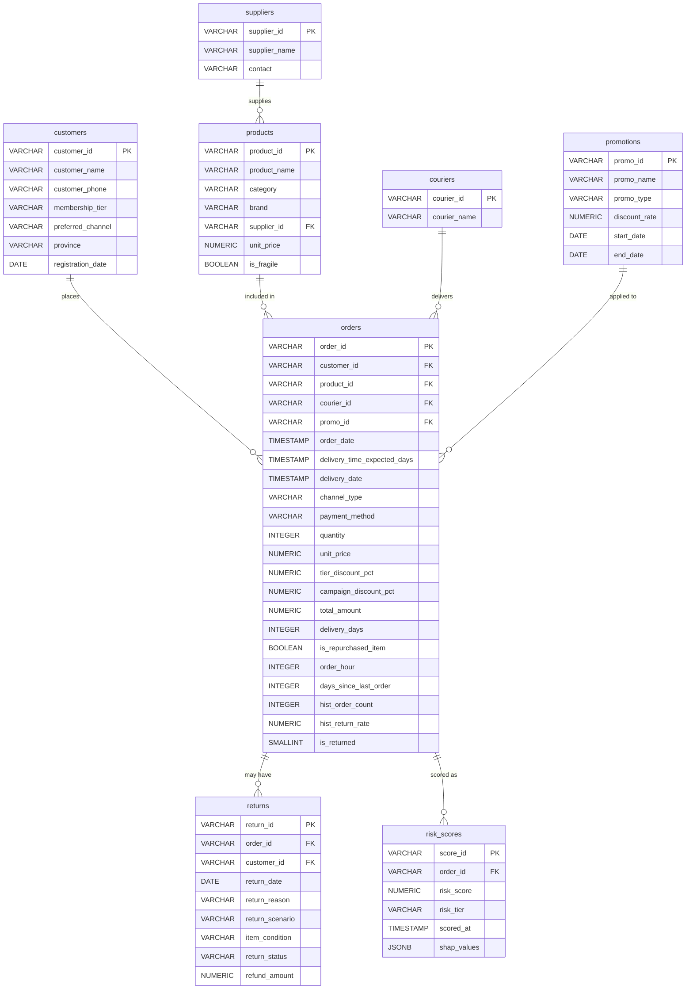

# 📊 Entity Relationship Diagram (ERD)

This diagram visualizes the data structure of the Return Risk Prediction system.

## Key Business Logic Notes
- **Order Table**: Acts as the central transaction hub, linking customers, products, logistics, and promotions.
- **Risk Scores**: Each order is evaluated by the ML model, generating a risk score and tier.
- **Returns**: A separate entity tracking post-delivery return events, linked back to the original order. Includes `item_condition` to distinguish between carrier damage and customer bracketing.
